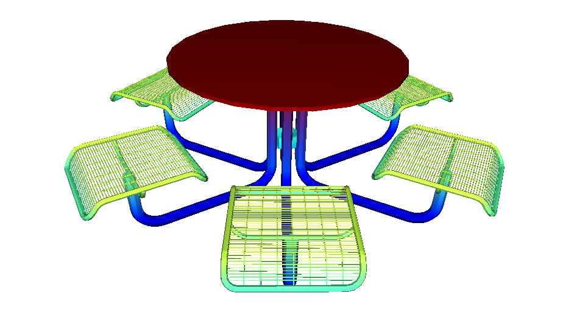
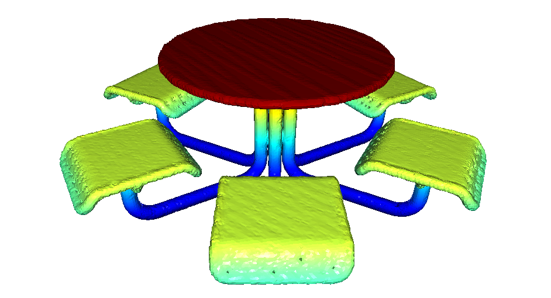

# Watertight Manifold Python Wrapper

This repository is a simple PythonWrapper around the origin implementation of
the paper:

Huang, Jingwei, Hao Su, and Leonidas Guibas. [**Robust Watertight Manifold
Surface Generation Method for ShapeNet
Models.**](https://arxiv.org/abs/1802.01698), arXiv preprint arXiv:1802.01698
(2018).

## Example

After installing this package you can check out the table example:
`./example/manifold_example.py ./example/table.ply`, that should produce this
result:
|            Input            |                Output                 |
| :-------------------------: | :-----------------------------------: |
|  |  |

## Installation

The package has no real dependencies besides a `C++` compiler and `CMake`. All
extra dependencies from the original code where removed, relying only on
`Eigen` and `glm`.

The python package is ready to be published, but in the meantime you need to
clone this repo and just run:

```sh
git submodule update --init
make install
```

## Usage

A full example using `Open3D` can be found in the provided
[example](example/manifold_example.py). This will requiere to install `click`
and `open3d`.

The Python API was desgined to be flexible and library agonistic, meaning that
the only thing you will need to interact with it are numpy arrays.

The interface consist in three steps:

1.  Instance an object of the ManifoldProcessor class by provding the vertices
    and triangles of the model as np.arrays of dimesions (n, 3)

```python
processor = manifold.Processor(vertices, triangles)
```

2.  Convert input mesh to a manifold:

```python
vertices, triangles = processor.get_manifold_mesh(depth=8)
```

5.  Use whatever you want with the vertices, triangles. For example convert it
    an `Open3D` TrianlgeMesh:

```python
manifold_mesh = o3d.geometry.TriangleMesh(
    o3d.utility.Vector3dVector(vertices),
    o3d.utility.Vector3iVector(triangles),
)
```

## Why the code is a bit different?

In order to provide a Python Wrapper I had to chop out all the stuff that was
not being used, this, to understand how the software was written but also to
make the python package as small and as minimalistic as possible. I haven't
really changed the original implementaiton(the idea), that's why the copyright
of this software sitll belongs to the [original authors](https://github.com/hjwdzh/Manifold#authors).

## Authors

### C++ API

- [Jingwei Huang](mailto:jingweih@stanford.edu) &copy; Stanford University

### Python Bindings

- [Ignacio Vizzo](mailto:ivizzo@uni-bonn.edu) &copy; Universiyt of Bonn

**IMPORTANT**: If you use this software please cite the following in any resulting publication:
```
@article{huang2018robust,
  title={Robust Watertight Manifold Surface Generation Method for ShapeNet Models},
  author={Huang, Jingwei and Su, Hao and Guibas, Leonidas},
  journal={arXiv preprint arXiv:1802.01698},
  year={2018}
}
```

If you find this package usefull you can give us a star in GitHub!

## Acknlodegments

We thanks [Jingwei Huang](mailto:jingweih@stanford.edu) for open sourcing his
implementation that allowed us to make this python wrapper.
